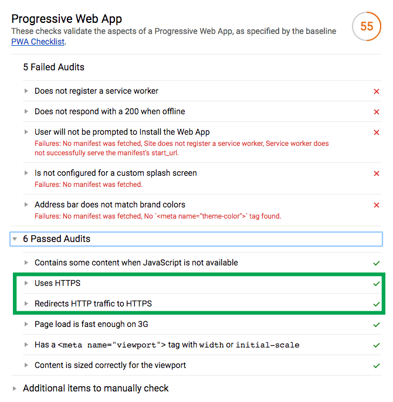

# PWA training

## Étape 1 : Héberger le site sur un service proposant le HTTPS

Pour ce tuto, nous allons utiliser [Firebase hosting](https://firebase.google.com/docs/hosting/) pour héberger notre application.

Les étapes ci-dessous sont décritent sur la doc ["Get Started" de Firebase Hosting](https://firebase.google.com/docs/hosting/quickstart)

### Installer le CLI Firebase

```
npm install -g firebase-tools
```

### Initialiser l'application

```
firebase init
```

Il faudra ensuite répondre à 2 questions : 
* Quelle fonctionnalité de Firebase => `Hosting`
* Quel projet => `[create a new project]`

La commande init va générer 2 fichiers : `.firebaserc` et `firebase.json` 

Il faudra ensuite créer un projet à partir de la [console Firebase](https://console.firebase.google.com)

Une fois le projet crée, il faut associer le projet à notre config firebase :

```
firebase use --add
```

## Déployer l'application

Nous devons préciser le dossier à déployer, dans `firebase.json` :

```
{
  "hosting": {
    "public": "public"
  }
}
```

[Plus d'infos sur la configuration de Firebase Hosting](https://firebase.google.com/docs/hosting/url-redirects-rewrites)

Pour déployer :

```
firebase deploy
```

## Ajout d'une commande de déploiement

Pour faciliter le déploiement, nous pouvons ajouter dans le fichier `package.json` une commande qui fait un build puis déploie l'application :

```json
"scripts": {
  ...
  "deploy": "npm run build && firebase deploy",
},
```

## Rapport Lighthouse de l'application hébergée

Maintenant que notre application est servie à travers le protocole HTTPS, nous obtenons un meilleur score et validons 2 points dans Lighthouse !



[Étape suivante : Mettre en place un Service Worker](https://github.com/makinacorpus/pwa-training/blob/master/02-service-worker.md)