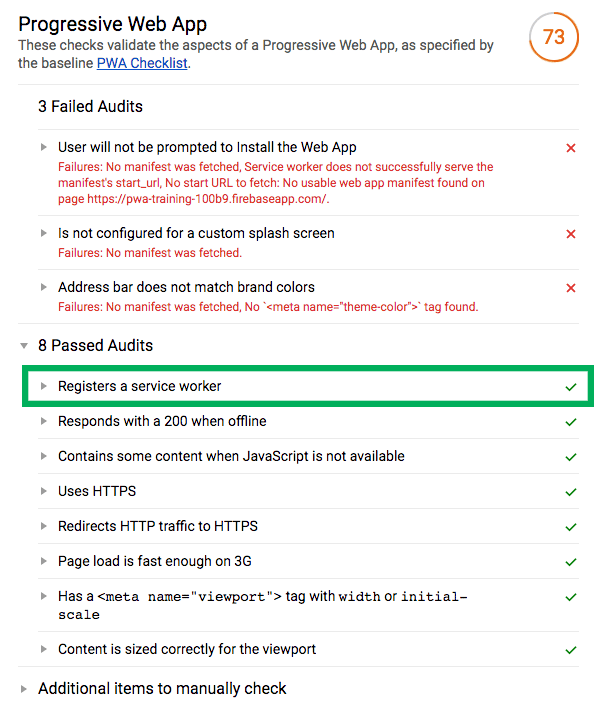

# PWA training

## Étape 2 : Mettre en place un Service Worker

La mise en place du Service Worker est décrite ici en plusieurs étapes :

* [Déclarer un Service Worker](#déclarer-un-service-worker)
* [Ajout des ressources statiques en cache](#ajout-des-ressources-statiques-en-cache)
* [Ajout des ressources dynamiques en cache](#ajout-des-ressources-dynamiques-en-cache)
* [Mise à jour du cache](#mise-à-jour-du-cache)
* [Prévoir un fallback si le cache et le réseau échouent](#prévoir-un-fallback-si-le-cache-et-le-réseau-échouent)

## Déclarer un Service Worker

Pour déclarer un Service Worker, nous aurons besoin d'ajouter un fichier javascript (car le SW s'exécute dans un thread différent) : `index.js` sera le fichier javascript de notre site, `service-worker.js` le fichier dédié au Service Worker.

```javascript
// index.js

if ('serviceWorker' in navigator) {
  navigator.serviceWorker.register('service-worker.js').then(registration => {
    // Le Service Worker est déclaré !
    console.log('Service Worker déclaré !');
  })
  .catch(error => {
    // Il y a eu un problème
    console.error('Erreur: ', error);
  });
}
```

```javascript
// service-worker.js

self.addEventListener("install", event => {
  console.log('Service Worker installé');
});
```

## Ajout des ressources statiques en cache

La deuxième étape consiste à mettre en cache les ressources statiques (les assets : html, css, js, fonts,...) du site. On utilisera la méthode `cache.addAll()` pour déclarer un tableau de ressources.

Il s'agit de la stratégie [On Install](https://developers.google.com/web/fundamentals/instant-and-offline/offline-cookbook/#on-install-as-dependency), principalement adaptée pour les assets d'un site qui n'ont pas besoin d'être systématiquement mise à jour.

```javascript
// service-worker.js

self.addEventListener('install', function(event) {
  event.waitUntil(
    caches.open(cacheName).then(function(cache) {
      return cache.addAll(
        [
          '/',
          '/bundle.js',
          '/style.css',
          ...
        ]
      );
    })
  );
});
```

Nous pourrons ensuite utiliser la stratégie [Cache first](https://developers.google.com/web/fundamentals/instant-and-offline/offline-cookbook/#cache-falling-back-to-network) afin de restituer les éléments en cache si c'est possible, puis sinon le réseau.

```javascript
// service-worker.js

self.addEventListener('fetch', function(event) {
  event.respondWith(
    caches.match(event.request).then(function(response) {
      return response || fetch(event.request);
    })
  );
});
```

À cette étape, nous avons une première expérience offline, nous devrions avoir le layout et les assets du site disponibles hors ligne. 

Par contre, les articles ne sont pas encore disponibles hors ligne, pour cela, nous allons avoir besoin de stocker dynamiquement les ressources chargées en asynchrone.


## Ajout des ressources dynamiques en cache

Pour stocker les ressources chargées dynamiquement via l'API, nous utiliserons la stratégie [On Network Response](https://developers.google.com/web/fundamentals/instant-and-offline/offline-cookbook/#on-network-response) : **les ressources sont mises en caches après une requête réseau**.


```javascript
// service-worker.js

fetch(event.request).then(function (response) {
    cache.put(event.request, response.clone());
    return response;
});
```

Afin de pouvoir mettre en place des stratégies différentes selon le type de ressource, **nous devrons d'abord pouvoir les dissocier**. On pourra par exemple vérifier l'origine de l'url :

```javascript
// service-worker.js

function shouldHandleFetch(event) {
  return (
    // On vérifie que la méthode est bien GET
    event.request.method.toLowerCase() === 'get' && (
      // et on vérifie si la ressource provient de media.guim.co.uk (le domaine pour les images)
      event.request.url.indexOf('media.guim.co.uk') !== -1
      // ou si c'est un appel à l'API guardianapis.com
      || event.request.url.indexOf('guardianapis.com') !== -1
    )
  )
}
```

Si la requête interceptée ne provient pas de l'API, on conserve la stratégie [Cache First](#ajout-des-ressources-statiques-en-cache), sinon, nous utiliserons la stratégie [Network first](https://developers.google.com/web/fundamentals/instant-and-offline/offline-cookbook/#network-falling-back-to-cache) : on charge d'abord via le réseau, sinon on cherche dans le cache.

```javascript
// service-worker.js

self.addEventListener('fetch', function(event) {
  event.respondWith(
    fetch(event.request).catch(function() {
      return caches.match(event.request);
    })
  );
});
```

## Mise à jour du cache

Pour supprimer les caches obsolètes, on va itérer sur les caches disponibles via **`caches.keys()`** et les supprimer tous sauf le cache en cours.

```javascript
// service-worker.js

self.addEventListener('activate', (event) => {
  // On créer une tableau de caches à "whitelister"
  var cacheWhitelist = [CACHE_NAME]
  event.waitUntil(
    // On récupère l'ensemble des caches disponibles
    caches.keys().then(cacheNames => {
      return Promise.all(
        // On itère sur chacun des caches
        cacheNames.map(cacheName => {
          // Si il n'est pas whitelisté, on le supprimme
          if (cacheWhitelist.indexOf(cacheName) === -1) {
            return caches.delete(cacheName);
          }
        })
      )
    })
  )
})
```

## Prévoir un message si le cache et le réseau échouent

La touche finale pour une expérience offline complète : renvoyer une page personnalisée au cas où ni le réseau, ni le cache ne répondent.

On pourra alors renvoyer un objet [Response](https://developer.mozilla.org/fr/docs/Web/API/Response) :

```javascript
event.respondWith(new Response(
    '<p>Application non disponible</p>',
    headers: {'Content-Type': 'text/html'}
));
```

## Rapport Lighthouse

À cette étape, nous devrions gagner quelques points sur Lighthouse.



Plus d'infos : [Caching Files with Service Worker](https://developers.google.com/web/ilt/pwa/caching-files-with-service-worker)

[Étape suivante : Configurer le manifest et l'icon de l'application](https://github.com/makinacorpus/pwa-training/blob/master/03-manifest.md)