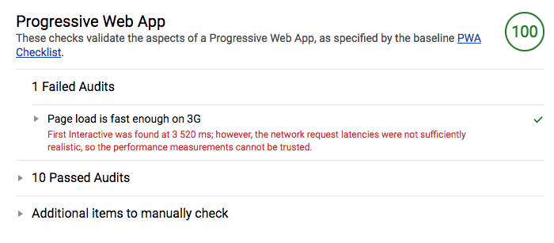

# PWA training

## Étape 3 : Configurer le manifest et l'icon de l'application

Pour que notre application se comporte comme une véritable app mobile, nous allons devoir déclarer un set d'icons pour les différents OS / tailles d'écran.

C'est le rôle du fichier `manifest.json`, que nous devrons référencer dans le html de notre page :

```html
<link rel="manifest" href="/manifest.json">
```

Le fichier **`manifest.json`** ressemble généralement à ceci :

```json
{
  "manifest_version": 1,
  "version": "1.0.0",
  "name": "PWA App",
  "short_name": "pwa-app",
  "description": "Simple PWA web application",
  "default_locale": "en",
  "icons": [
        {
            "src": "/icons/android-chrome-192x192.png",
            "sizes": "192x192",
            "type": "image/png"
        },
        {
            "src": "/icons/android-chrome-256x256.png",
            "sizes": "256x256",
            "type": "image/png"
        }
    ],
  "start_url": "/",
  "display": "standalone",
  "background_color": "#121738",
  "theme_color": "#d17c78"
}
```

### Style du splash screen

Le splash screen s'affichera selon la configuration du manifest :

* `name` : le nom de l'application qui sera affiché sur le splash screen
* `background_color` : la couleur de fond
* `theme_color` : la couleur qui sera utilisée pour la barre


Pour générer les icons de l'application ainsi que le code, on peut utiliser [Real Favicon Generator](https://realfavicongenerator.net/).


## Test Lighthouse

Une fois effectué toutes ces étapes, relançons un test Lighthouse depuis l'application hébergée sur Firebase. Normalement nous devrions obtenir un score de 100 !

