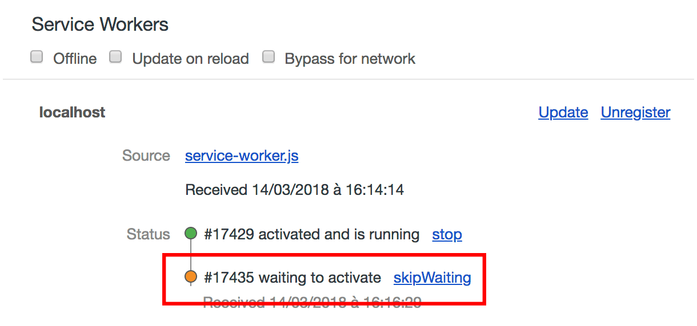

# PWA training

## Étape 4 : Notifier l'utilisateur lors d'une mise à jour

Comme nous avons mis en place la stratégie *Cache First* pour les assets, s'il y a une modification du template, **l'utilisateur ne la verra pas tant qu'il n'aura pas vider son cache**.

Cette fonctionnalité peut se mettre en place en 3 étapes :

- [Détecter une nouvelle version](#détecter-une-nouvelle-version)
- [Afficher la notification](#afficher-la-notification)
- [Effectuer la mise à jour](#effectuer-la-mise-à-jour)
- Recharger la mage

### Détecter une nouvelle version

Pour vérifier si une nouvelle version de l'application est disponible, nous devons d'abord bien comprendre [son cycle de vie](https://developers.google.com/web/fundamentals/primers/service-workers/lifecycle).

Nous devrons imaginer un scénario permettant de détecter si un Service Worker est en attente et prêt à être activé. Si c'est le cas, il apparaîtra dans les devtools :



Lorsqu'on détecte une mise à jour, alors on affiche la notification.


### Afficher la notification

Pour cela, nous allons utiliser un `toast`, aussi appelé [`snackbar` dans MDL](https://getmdl.io/components/index.html#snackbar-section).

```html
// index.html

<div id="notification-toast-example" class="mdl-js-snackbar mdl-snackbar">
  <div class="mdl-snackbar__text"></div>
  <button class="mdl-snackbar__action" type="button"></button>
</div>
```

```javascript
// index.js

function update() {
  // Le code qui sera exécuté si l'utilisateur accepte la mise à jour
}

var snackbarContainer = document.querySelector('#notification-toast-example');
function showUpdateNotification() {
  snackbarContainer.MaterialSnackbar.showSnackbar({
    message: 'Une mise à jour est disponible.',
    timeout: 4000,
    actionHandler: update,
    actionText: 'Refraîchir'
  });
}
```

### Effectuer la mise à jour

Lorsque l'utilisateur accepte la mise à jour, nous pourrons communiquer au service worker cette action grâce à l'[API `postMessage()`](https://developer.mozilla.org/fr/docs/Web/API/Window/postMessage)


Lorsque le service worker reçoit l'événement message transmis, on pourra activer le nouveau Service Worker avec `skipWaiting()`

```javascript
// service-worker.js

self.skipWaiting();
```

Dernière étape, pour que la nouvelle version du site soit visible, nous devrons recharger la page.