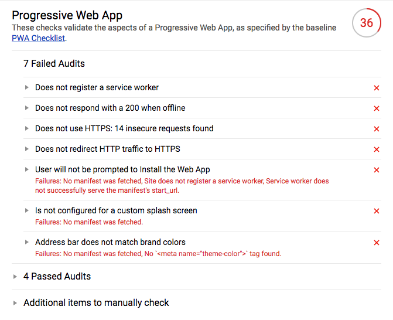

# PWA training

## Récupérer le projet

```
git clone git@github.com:makinacorpus/pwa-training.git
```

Le projet contient un site avec un style [Material Design Lite](https://getmdl.io/). Le contenu du dossier public servira de base pour construire une app en PWA.

## Installer les dépendances et démarrer le projet

```bash
npm i
npm start       ## Démarer le server de dev
npm run build   ## Générer le build de prod
```

* **Les templates** sont dans le dossier public (`index.html` et `about.html`). 
* Ils font appel à un fichier js `bundle.js`, généré par webpack pour permettre d'écrire en ES6.
* Le fichier **javascript** source est `src/index.js`

## Installer l'extension [Lighthouse](https://chrome.google.com/webstore/detail/lighthouse/blipmdconlkpinefehnmjammfjpmpbjk?hl=fr) et lancer l'analyse de la page

Une fois le rapport généré, nous allons nous intéresser à la partie **Progressive Web App**. Les autres sections obtiennent normalement un score correct.

Le but est d'attendre un score de 100 (ou presque). Lighthouse nous indique chaque point à améliorer pour atteindre ce score.



## Transformer une application en PWA pas à pas

- [Étape 2](https://github.com/makinacorpus/pwa-training/blob/master/01-firebase.md) : Héberger le site sur un service proposant le HTTPS ([Firebase Hosting](https://firebase.google.com/docs/hosting/))

- [Étape 1](https://github.com/makinacorpus/pwa-training/blob/master/02-service-worker.md) : Mettre en place un Service Worker

- [Étape 3](https://github.com/makinacorpus/pwa-training/blob/master/03-manifest.md) : Configurer le manifest et l'icon de l'application